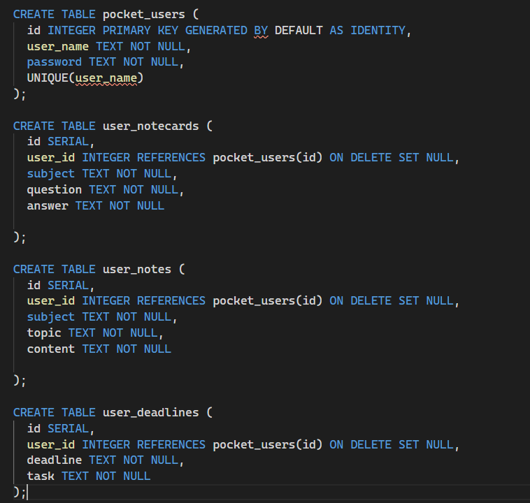

<h1>Prerequisites</h1>
  
Built using Node v13.7.0, other versions not tested

<h1>Installation</h1>
  
To install dependencies run npm install (npm i)

<h1>Schema</h1>

<h1>Endpoints</h1>

<h2>/api/validateuser</h2>
  <h3>Validates user login //POST//</h3>  
  
req.body = { userName: string, userPassword: string }; 

    

<h2>/api/adduser</h2>
  <h3>Adds user to the database //POST//</h3>
  
 req.body = { userName: string, userPass: string }; 

<h2>/api/notecards</h2>
  <h3>GET</h3>
  <h4>retrieve user notecards</h4>
  
req.query is set to User.id

  
res.body =  {
        "id": 1,
        "user_id": 1,
        "subject": "Physics",
        "question": "What is the equation for terminal velocity",
        "answer": "v = the square root of ((2*m*g)/(p*A*C))"
    }

  <h3>POST</h3>
  <h4>post new notecard</h4>
  
req.body =  {
        "user_id": 1,
        "subject": "Physics",
        "question": "What is the equation for terminal velocity",
        "answer": "v = the square root of ((2*m*g)/(p*A*C))"
    }, send specific user id

  <h3>DELETE</h3>
  <h4>delete a users notecard</h4>
  
req.body must have id of notecard.example {id: 3}

  <h3> EDIT /api/notecards/edit </h3>

    <h4> edit existing notecard </h4>
    
req.body = {
	"id":"2",
	"note_id":"1",
	"subject":"Updated",
	"question":"new question?",
	"answer":"new answer"
	

}

  
<h2>/api/notes</h2>
  <h3>GET</h3>
  
req.query.userId = id , set a query named userId to equal the users id 

  
res.body = {

        "id": 1,
        "user_id": 1,
        "subject": "Physics",
        "topic": "Equations",
        "content": "e=mc^2"
    }

  <h3>DELETE</h3>
  
send user id and note id in the body

  
req.body = {user_id: 1, note_id: 1}; 

  <h3>/api/notes/add</h3>
    <h4>POST</h4>
    
add a new notecard

    
req.body example = { user_id: 1, subject: ex, topic: ex, content: ex}

  <h3>/api/notes/edit</h3>
    <h4>POST</h4>
    
edit a current notecard

    
req.body example = {
	      "note_id": "1",
	      "id": "2",
	      "subject": "Physics",
	      "topic": "Equations",
	      "content": "Matthew"
      }

<h2>/api/deadlines</h2>
  <h3>GET</h3>
  
retrieves user deadlines

  
req.query.userId = id , set a query named userId to equal the users id 

  
res.body example = { id: 1, user_id: 1, deadline: ex, task: ex };

  <h3>POST</h3>
  
posts a new deadline

  
req.body example = { user_id: 1, deadline: ex, task: ex }

  <h3>DELETE</h3>
  
deletes a deadline, only requires deadline id

  
req.body example = { id: 1}

<h1>Built With</h1>
<ul>
  <li>Node</li>
  <li>Express</li>
  <li>PostgresSQL</li>
  <li>Knex</li>
  <li>Mocha</li>
  <li>Chai</li>
  <li>Supertest</li>
</ul>
 

